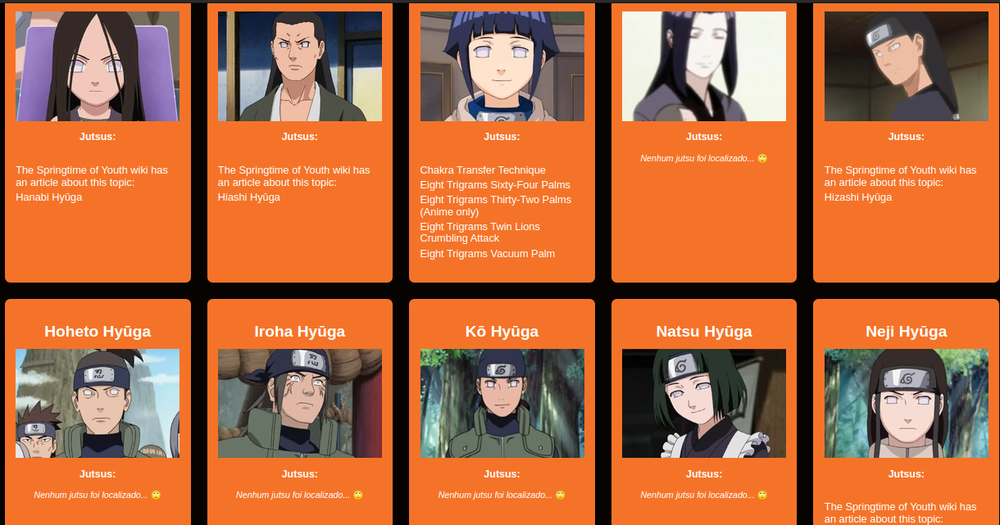

# Naruto API Consumer 👱


Este projeto é uma aplicação em React que consome a API [NarutoDB](https://www.narutodb.xyz/) para exibir informações sobre os 1431 personagens do universo Naruto.

## Como Executar o Projeto 👩‍💻

Siga os passos abaixo para executar este projeto em seu ambiente de desenvolvimento:

### 1. Inicialize o Servidor Intermediário ✅

Navegue até o diretório `servidor_intermediario` no terminal e execute o seguinte comando para inicializar o servidor intermediário:

```bash
node servidor.mjs
```

### 2. Inicialize a Aplicação React ✅

Navegue até o diretório `naruto` no terminal e execute o seguinte comando para iniciar a aplicação React:

```bash
npm start
```
Isso iniciará a aplicação React e abrirá a interface no seu navegador padrão. Você poderá visualizar e interagir com as informações dos personagens do universo Naruto.

O react provavelmente informará que já existe algo em execução na porta 3000 e perguntará se você deseja executar em outra porta. Digite 'y' e dê enter.

#### Pronto! Agora, você está pronto para explorar o mundo do Naruto e obter informações sobre os 1431 personagens. Divirta-se! 🤩
## Screenshot 📸



